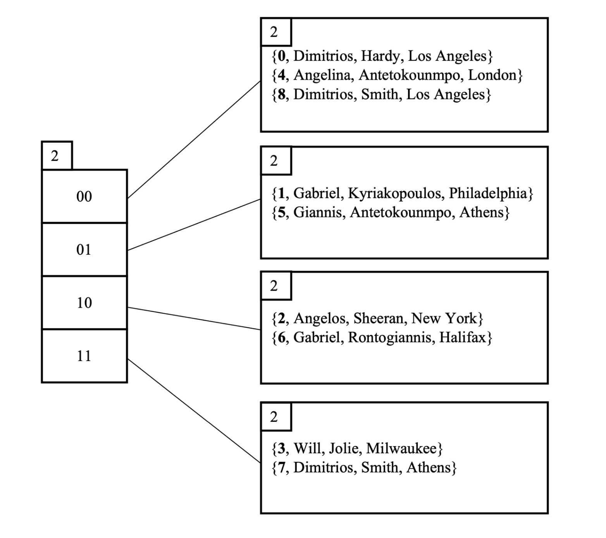
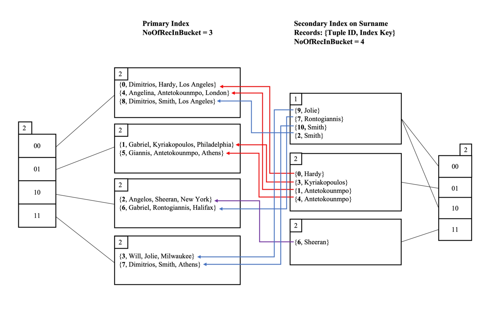

# 🗃️ Extendible Hashing 

Implementation of [Extendible Hashing](https://en.wikipedia.org/wiki/Extendible_hashing) for both primary and secondary indexing in database systems.

## Primary Indexing Extendible Hashing

## Secondary Indexing Extendible Hashing

## Authors
* [Angelos Poulis](https://github.com/angelosps)
* [Dimitrios Kyriakopoulos](https://github.com/dimitrskpl)
* [Dimitrios Rontogiannis](https://github.com/rondojim)
